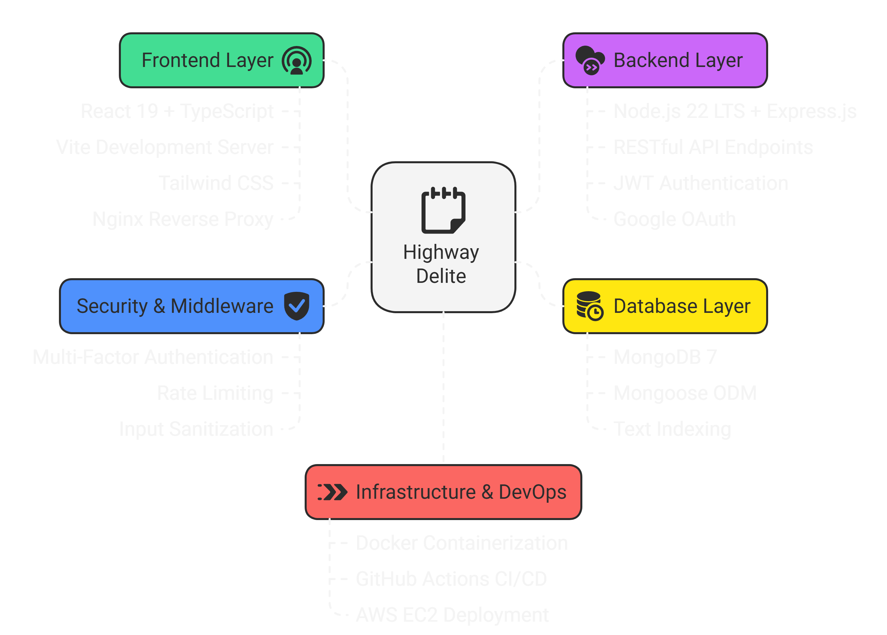
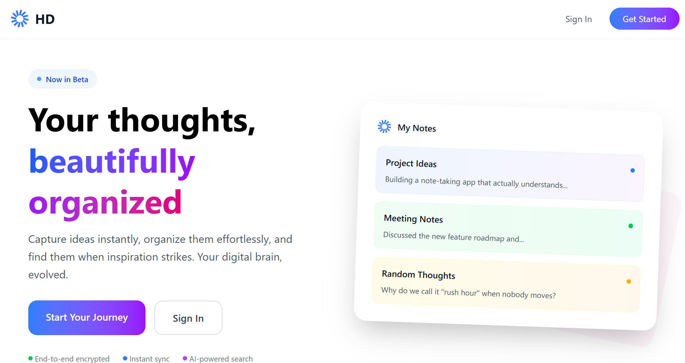
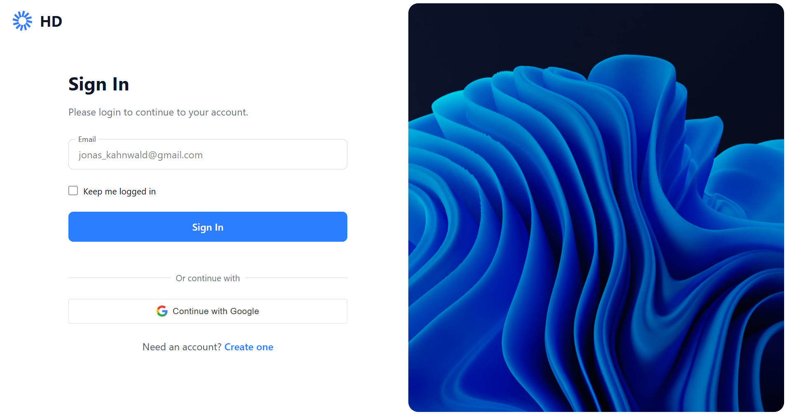
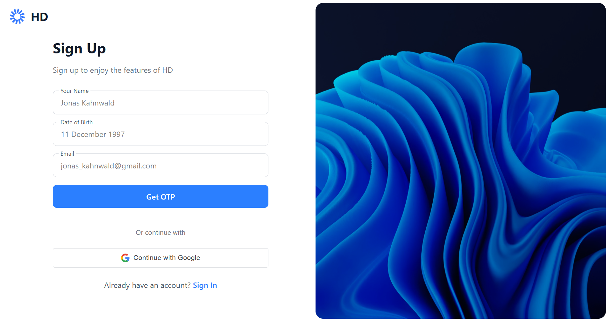
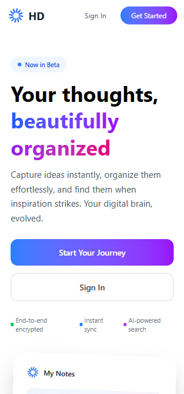
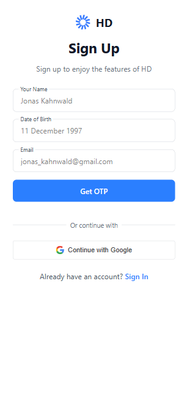
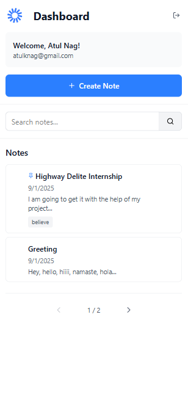
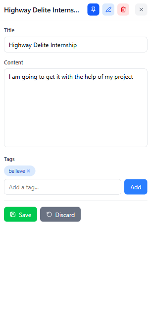

# Highway Delite - Note Taking Application

A production-ready, full-stack note-taking application w## Professional Development Showcase

### **Enterprise Security Implementation** enterprise-grade security, Docker containerization, and AWS deployment pipeline.

## Application Screenshots

### System Architecture
<div align="center">
  
</div>

### Desktop Screenshots
<div align="center">
  <table>
    <tr>
      <td width="33%">
        
        <p align="center"><em>Home Page</em></p>
      </td>
      <td width="33%">
        
        <p align="center"><em>Sign In</em></p>
      </td>
      <td width="33%">
        
        <p align="center"><em>Sign Up</em></p>
      </td>
    </tr>
    <tr>
      <td width="33%">
        
        <p align="center"><em>Note Editing</em></p>
      </td>
      <td width="33%">
        
        <p align="center"><em>Creating Note with Tags</em></p>
      </td>
      <td width="33%">
        
        <p align="center"><em>Pagination & Pin Feature</em></p>
      </td>
    </tr>
  </table>
</div>

### Mobile Screenshots
<div align="center">
  <table>
    <tr>
      <td width="25%">
        
        <p align="center"><em>Home</em></p>
      </td>
      <td width="25%">
        
        <p align="center"><em>Sign Up</em></p>
      </td>
      <td width="25%">
        
        <p align="center"><em>Dashboard</em></p>
      </td>
      <td width="25%">
        
        <p align="center"><em>Note Editing</em></p>
      </td>
    </tr>
  </table>
</div>

## Production Features

### Enterprise Security
- **Multi-Factor Authentication**: Email + OTP (passwordless) + Google OAuth
- **Demo-Friendly Rate Limiting**: 50 auth requests/15min, 10s OTP cooldown (optimized for testing)
- **Input Sanitization**: XSS & NoSQL injection protection on all endpoints
- **Security Headers**: Helmet.js with CSP, HSTS, and security best practices
- **JWT Authentication**: Secure token-based auth with refresh capabilities

### DevOps & Deployment
- **Docker Containerization**: Multi-stage builds with Node.js 22 (latest LTS)
- **AWS EC2 Deployment**: Automated CI/CD pipeline with GitHub Actions
- **Production Monitoring**: Winston logging with error tracking and health checks
- **Environment Management**: Secure secrets handling and multi-environment support
- **Database Optimization**: MongoDB indexing and query optimization

### Performance & Scalability
- **Advanced Search**: MongoDB text indexing with pagination and filtering
- **Bulk Operations**: Efficient mass operations with proper validation
- **Resource Management**: Request size limits (10MB) and connection pooling
- **Caching Strategy**: Proper HTTP headers and client-side caching
- **Error Handling**: Comprehensive error middleware with user-friendly responses

## Core Features

- **User Authentication**: JWT + Google OAuth integration
- **Note Management**: Full CRUD operations with rich text support
- **Advanced Search**: Text search with pagination and filtering
- **Pin Important Notes**: Quick access to priority content
- **Bulk Operations**: Efficient mass note management
- **Responsive Design**: Seamless mobile and desktop experience
- **Real-time Updates**: Live note synchronization

### **Professional Development Showcase**

###  **Enterprise Security Implementation**
- **Zero-Password Authentication**: Email OTP + Google OAuth integration
- **Per-User Rate Limiting**: Individual quotas (200 req/10min) preventing system abuse
- **Attack Prevention**: XSS sanitization, NoSQL injection protection, CSRF protection
- **Security Headers**: CSP, HSTS, X-Frame-Options via Helmet.js middleware

### **Production DevOps Pipeline**
- **Containerized Deployment**: Docker multi-stage builds with Node.js 22 LTS
- **CI/CD Automation**: GitHub Actions with automated testing and AWS deployment
- **Infrastructure as Code**: Automated EC2 setup with production environment management
- **Zero-Downtime Deployment**: Health checks, rollback capabilities, backup management

### **Performance & Scalability**
- **Database Optimization**: MongoDB text indexing for sub-second search results
- **Advanced Query System**: Pagination, filtering, sorting with efficient compound indexes
- **Resource Management**: Request size limits, connection pooling, memory optimization
- **Monitoring & Logging**: Structured Winston logging with error tracking and analytics

### **Modern Development Practices**
- **Type Safety**: Full TypeScript implementation across frontend and backend
- **API Design**: RESTful endpoints with consistent error handling and validation
- **Code Quality**: ESLint, Prettier, and comprehensive error boundary handling
- **Testing Ready**: Structured for unit, integration, and E2E testing implementation

## Demo Information

### Live Demo Access
<div align="center">
  <table>
    <tr>
      <td align="center" style="padding: 20px;">
        <a href="http://ec2-13-61-142-247.eu-north-1.compute.amazonaws.com:5173" target="_blank">
          
        </a>
        <br>
        <small><em>Full features including Google OAuth</em></small>
      </td>
      <td align="center" style="padding: 20px;">
        <a href="http://13.61.142.247:5173" target="_blank">
          
        </a>
        <br>
        <small><em>Mobile-friendly (OAuth disabled due to origin restrictions)</em></small>
      </td>
    </tr>
  </table>
</div>

> **Note**: The DNS version may not work on mobile due to SSL certificate requirements. The direct IP version is provided for mobile testing but has Google OAuth disabled as it's considered an invalid origin by Google's security policies.

### **Rate Limiting (Security Feature)**
- **Authentication**: 50 requests per 15 minutes per IP (demo-optimized)
- **OTP Cooldown**: 10 seconds between requests (balances security and UX)
- **Note**: In production, these limits can be adjusted based on usage patterns

### **Mobile Access Note**
Due to modern mobile browser security policies blocking HTTP connections, 
mobile access may be limited. This is intentional for the demo environment.
Production deployment would use HTTPS with SSL certificates.

## Technology Stack

### Frontend
- **React 19** with TypeScript
- **Vite** for lightning-fast development
- **Tailwind CSS** for modern styling
- **Context API** for state management

### Backend
- **Node.js 22 LTS** with Express.js
- **MongoDB 7** with Mongoose ODM
- **JWT Authentication** with refresh tokens
- **TypeScript** for type safety

### Infrastructure & DevOps
- **Docker** & Docker Compose for containerization
- **Multi-stage builds** for optimization
- **GitHub Actions** for CI/CD pipeline
- **AWS EC2** for production deployment
- **Nginx** reverse proxy
- **Winston** structured logging

## Quick Start with Docker

### Prerequisites
- Docker Desktop installed and running
- Docker Compose v2+ (newer `docker compose` syntax)

### Setup
```bash
# Clone and start
git clone <repository-url>
cd highway-delite
docker compose up -d

# Access the application
# Frontend: http://localhost:5173
# Backend: http://localhost:5000
```

### Docker Commands
```bash
# Start all services
docker compose up -d

# View logs
docker compose logs -f [service-name]

# Stop all services
docker compose down

# Fresh start (removes all data)
docker compose down -v && docker compose up -d
```

### Docker Compose Version Note
This project uses the newer `docker compose` syntax (Docker Compose v2+). The old `docker-compose` syntax is deprecated on modern platforms including GitHub Actions, AWS, and newer Docker installations.

## Manual Installation

### Prerequisites
- Node.js 20+
- MongoDB 7+

### Backend Setup
```bash
cd server
npm install
cp .env.example .env
# Edit .env with your configuration
npm run dev
```

### Frontend Setup
```bash
cd client
npm install
npm run dev
```

## Production Deployment

### Using Deploy Script
```bash
chmod +x deploy.sh
./deploy.sh
```

### Manual Docker Production
```bash
docker compose up -d --build
```

## Environment Variables

### Backend (.env)
```env
NODE_ENV=development
PORT=5000
MONGODB_URI=mongodb://localhost:27017/highway_delite
JWT_SECRET=your-jwt-secret
GOOGLE_CLIENT_ID=your-google-client-id
GOOGLE_CLIENT_SECRET=your-google-client-secret
GMAIL_EMAIL=your-email@gmail.com
GMAIL_PASSWORD=your-app-password
```

### Frontend (.env)
```env
VITE_API_URL=http://localhost:5000/api
VITE_GOOGLE_CLIENT_ID=your-google-client-id
```

## API Endpoints

### Authentication
- POST `/api/auth/register` - Register user
- POST `/api/auth/login` - Login user
- POST `/api/auth/google` - Google OAuth
- POST `/api/auth/refresh` - Refresh token

### Notes
- GET `/api/notes` - Get all notes
- POST `/api/notes` - Create note
- PUT `/api/notes/:id` - Update note
- DELETE `/api/notes/:id` - Delete note
- PUT `/api/notes/:id/pin` - Toggle pin

## Development

### Backend Development
```bash
cd server
npm run dev        # Start with nodemon
npm run build      # TypeScript build
npm test           # Run tests
```

### Frontend Development
```bash
cd client
npm run dev        # Start dev server
npm run build      # Production build
npm run preview    # Preview build
```

## CI/CD & Deployment

### GitHub Actions
Automated CI/CD pipeline with:
- Automated testing on push/PR
- Docker image building
- AWS EC2 deployment
- Health checks and rollback

### AWS Deployment
Production deployment on AWS EC2 with:
- Automated Docker deployment
- Health monitoring
- Zero-downtime updates
- Cost optimization for free tier

---

**Status**: Production-Ready with AWS Deployment  
**Tech Focus**: Full-Stack TypeScript, DevOps, Security Engineering

## License

MIT License
